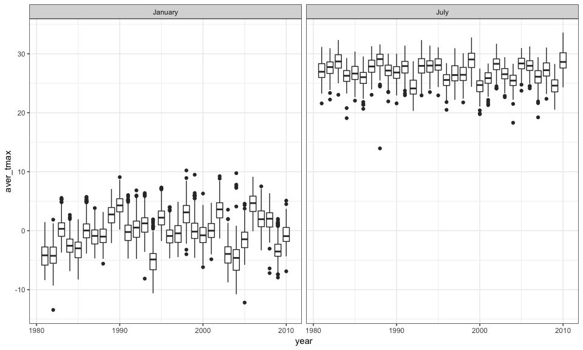

Homework\_3
================
Xinyi Lin
10/11/2018

``` r
library(tidyverse)
```

    ## ── Attaching packages ──────────────────────────────────────────────────────────────────────── tidyverse 1.2.1 ──

    ## ✔ ggplot2 3.0.0     ✔ purrr   0.2.5
    ## ✔ tibble  1.4.2     ✔ dplyr   0.7.6
    ## ✔ tidyr   0.8.1     ✔ stringr 1.3.1
    ## ✔ readr   1.1.1     ✔ forcats 0.3.0

    ## ── Conflicts ─────────────────────────────────────────────────────────────────────────── tidyverse_conflicts() ──
    ## ✖ dplyr::filter() masks stats::filter()
    ## ✖ dplyr::lag()    masks stats::lag()

``` r
knitr::opts_chunk$set(
  fig.width = 16,
  fig.asp = .6,
  out.width = "100%"
)

theme_set(theme_bw() + theme(legend.position = "bottom"))
```

Problem 1
=========

Load and clean data
-------------------

``` r
brfss_df = 
  p8105.datasets::brfss_smart2010 %>% 
  janitor::clean_names() %>% 
  filter(topic == "Overall Health") %>% 
  mutate(response = factor(response, order = TRUE, levels = c("Excellent", "Very good", "Good", "Fair", "Poor")))
```

Answer questions
----------------

### Question 1

``` r
brfss_df %>% 
  filter(year == 2002) %>% 
  group_by(locationabbr) %>% 
  summarise(locations_num = length(unique(locationdesc))) %>% 
  filter(locations_num == 7)
```

    ## # A tibble: 3 x 2
    ##   locationabbr locations_num
    ##   <chr>                <int>
    ## 1 CT                       7
    ## 2 FL                       7
    ## 3 NC                       7

According to the table above, we can find that "CT", "FL", "NC" were observed at 7 locations.

### Question 2

``` r
brfss_df %>% 
  group_by(locationabbr, year) %>% 
  summarise(locations_num = length(unique(locationdesc))) %>% 
  ggplot(aes(x = year, y = locations_num, color = locationabbr)) +
  geom_line() 
```


``` r
head(brfss_df)
```

    ## # A tibble: 6 x 23
    ##    year locationabbr locationdesc class topic question response sample_size
    ##   <int> <chr>        <chr>        <chr> <chr> <chr>    <ord>          <int>
    ## 1  2010 AL           AL - Jeffer… Heal… Over… How is … Excelle…          94
    ## 2  2010 AL           AL - Jeffer… Heal… Over… How is … Very go…         148
    ## 3  2010 AL           AL - Jeffer… Heal… Over… How is … Good             208
    ## 4  2010 AL           AL - Jeffer… Heal… Over… How is … Fair             107
    ## 5  2010 AL           AL - Jeffer… Heal… Over… How is … Poor              45
    ## 6  2010 AL           AL - Mobile… Heal… Over… How is … Excelle…          91
    ## # ... with 15 more variables: data_value <dbl>,
    ## #   confidence_limit_low <dbl>, confidence_limit_high <dbl>,
    ## #   display_order <int>, data_value_unit <chr>, data_value_type <chr>,
    ## #   data_value_footnote_symbol <chr>, data_value_footnote <chr>,
    ## #   data_source <chr>, class_id <chr>, topic_id <chr>, location_id <chr>,
    ## #   question_id <chr>, respid <chr>, geo_location <chr>

### Question 3

``` r
brfss_df %>% 
  filter(year == 2002 | year == 2006 | year == 2010, locationabbr == "NY", response == "Excellent") %>%
  group_by(year) %>% 
  summarise(excellent_mean = mean(data_value),
            excellent_sd = sd(data_value, na.rm = ))
```

    ## # A tibble: 3 x 3
    ##    year excellent_mean excellent_sd
    ##   <int>          <dbl>        <dbl>
    ## 1  2002           24.0         4.49
    ## 2  2006           22.5         4.00
    ## 3  2010           22.7         3.57

### Question 4

``` r
aver_prop_df =
  brfss_df %>% 
  group_by(year, locationabbr, response) %>% 
  summarise(average_proportion = mean(data_value))

# draw plot
ggplot(aver_prop_df, aes(x = year, y = average_proportion, color = locationabbr)) +
  geom_point() + 
  facet_grid(.~ response) +
  ylab("aver_proportion(%)") +
  theme(legend.position = "none") + 
  theme(axis.text.x = element_text(angle = 45))
```

    ## Warning: Removed 21 rows containing missing values (geom_point).


Problem 2
=========

Load and describe data set
--------------------------

``` r
instacart_df =
  p8105.datasets::instacart %>% 
  janitor::clean_names()

head(instacart_df)
```

    ## # A tibble: 6 x 15
    ##   order_id product_id add_to_cart_ord… reordered user_id eval_set
    ##      <int>      <int>            <int>     <int>   <int> <chr>   
    ## 1        1      49302                1         1  112108 train   
    ## 2        1      11109                2         1  112108 train   
    ## 3        1      10246                3         0  112108 train   
    ## 4        1      49683                4         0  112108 train   
    ## 5        1      43633                5         1  112108 train   
    ## 6        1      13176                6         0  112108 train   
    ## # ... with 9 more variables: order_number <int>, order_dow <int>,
    ## #   order_hour_of_day <int>, days_since_prior_order <int>,
    ## #   product_name <chr>, aisle_id <int>, department_id <int>, aisle <chr>,
    ## #   department <chr>

The data set "instacart" records the data about orders information, it contains 1384617 observations and 15 variables. Among those variables, `order_id`, `order_number`, `aisle`, `department` are important. For example, for the first observation, product"Bulgarian Yogurt" with id 49302 is the first product add in the number one order by user 112108. This order is the forth order of this user and it is placed at 10. The product comes from aisle "yogurt" and department "dairy eggs".

Answer Questions
----------------

### Question 1

``` r
asile_num = length(unique(instacart_df$aisle))

aisle_item_df =
  instacart_df %>% 
  group_by(aisle,department) %>% 
  summarise(items_num = n()) %>% 
  arrange(desc(items_num))

aisle_item_df
```

    ## # A tibble: 134 x 3
    ## # Groups:   aisle [134]
    ##    aisle                         department items_num
    ##    <chr>                         <chr>          <int>
    ##  1 fresh vegetables              produce       150609
    ##  2 fresh fruits                  produce       150473
    ##  3 packaged vegetables fruits    produce        78493
    ##  4 yogurt                        dairy eggs     55240
    ##  5 packaged cheese               dairy eggs     41699
    ##  6 water seltzer sparkling water beverages      36617
    ##  7 milk                          dairy eggs     32644
    ##  8 chips pretzels                snacks         31269
    ##  9 soy lactosefree               dairy eggs     26240
    ## 10 bread                         bakery         23635
    ## # ... with 124 more rows

There are 134 aisles and the "fresh vegetables" aisle is the most items ordered from. As we can find in the table, aisle which more items ordered from are ingredients we need everyday.

### Question 2

``` r
aisle_item_df %>% 
  as.data.frame() %>% 
  mutate(aisle = reorder(aisle, desc(items_num))) %>% 
  ggplot(aes(x = aisle, y = items_num)) + 
  geom_point() +
  theme(axis.text.x = element_text(angle = 45, hjust = 1, size = 5)) 
```


### Question 3

``` r
instacart_df %>% 
  filter(aisle == "baking ingredients" | aisle == "dog food care" | aisle == "packaged vegetables fruits") %>% 
  group_by(aisle, product_name) %>% 
  summarise(orders_num = length(unique(order_id))) %>% 
  mutate(rank = min_rank(desc(orders_num))) %>% 
  filter(rank == 1)
```

    ## # A tibble: 3 x 4
    ## # Groups:   aisle [3]
    ##   aisle                product_name                       orders_num  rank
    ##   <chr>                <chr>                                   <int> <int>
    ## 1 baking ingredients   Light Brown Sugar                         499     1
    ## 2 dog food care        Snack Sticks Chicken & Rice Recip…         30     1
    ## 3 packaged vegetables… Organic Baby Spinach                     9784     1

``` r
  #arrange(aisle, desc(orders_num)) %>% 
```

Question 4
----------

``` r
instacart_df %>% 
  filter(product_name == "Pink Lady Apples" | product_name == "Coffee Ice Cream") %>% 
  group_by(product_name, order_dow) %>% 
  summarise(mean_hour_day = mean(order_hour_of_day)) %>% 
  mutate(order_dow = factor(order_dow, levels = 0:6,
                      labels = c("Sun", "Mon", "Tue", "Wed", "Thu", "Fri", "Sat"))) %>% 
  spread(key = order_dow, value = mean_hour_day)
```

    ## # A tibble: 2 x 8
    ## # Groups:   product_name [2]
    ##   product_name       Sun   Mon   Tue   Wed   Thu   Fri   Sat
    ##   <chr>            <dbl> <dbl> <dbl> <dbl> <dbl> <dbl> <dbl>
    ## 1 Coffee Ice Cream  13.8  14.3  15.4  15.3  15.2  12.3  13.8
    ## 2 Pink Lady Apples  13.4  11.4  11.7  14.2  11.6  12.8  11.9

According to the table, we can found that the difference of mean order hour of the day between two items or two days is not significant. And Wednesday is have more orders for two items.

Problem 3
=========

Load and describe data
----------------------

``` r
ny_noaa_df =
  p8105.datasets::ny_noaa %>% 
  janitor::clean_names()

ny_noaa_df
```

    ## # A tibble: 2,595,176 x 7
    ##    id          date        prcp  snow  snwd tmax  tmin 
    ##    <chr>       <date>     <int> <int> <int> <chr> <chr>
    ##  1 US1NYAB0001 2007-11-01    NA    NA    NA <NA>  <NA> 
    ##  2 US1NYAB0001 2007-11-02    NA    NA    NA <NA>  <NA> 
    ##  3 US1NYAB0001 2007-11-03    NA    NA    NA <NA>  <NA> 
    ##  4 US1NYAB0001 2007-11-04    NA    NA    NA <NA>  <NA> 
    ##  5 US1NYAB0001 2007-11-05    NA    NA    NA <NA>  <NA> 
    ##  6 US1NYAB0001 2007-11-06    NA    NA    NA <NA>  <NA> 
    ##  7 US1NYAB0001 2007-11-07    NA    NA    NA <NA>  <NA> 
    ##  8 US1NYAB0001 2007-11-08    NA    NA    NA <NA>  <NA> 
    ##  9 US1NYAB0001 2007-11-09    NA    NA    NA <NA>  <NA> 
    ## 10 US1NYAB0001 2007-11-10    NA    NA    NA <NA>  <NA> 
    ## # ... with 2,595,166 more rows

``` r
prcp_na_num =
  ny_noaa_df %>% 
  filter(is.na(prcp)) %>% 
  nrow()

snow_na_num =
  ny_noaa_df %>% 
  filter(is.na(snow)) %>% 
  nrow()

snwd_na_num =
  ny_noaa_df %>% 
  filter(is.na(snwd)) %>% 
  nrow()

tmax_na_num =
  ny_noaa_df %>% 
  filter(is.na(tmax)) %>% 
  nrow()

tmin_na_num =
  ny_noaa_df %>% 
  filter(is.na(tmin)) %>% 
  nrow() 
```

There are 2595176 observations and 7 variables in NY NOAA data, and key variables including `date`, `prcp`, `snow`. In `prcp` variables, the proportion of missing values is 5.62%. In `snow` variables, the proportion of missing values is 14.7%. In `snwd` variables, the proportion of missing values is 22.8%. In `tmax` variables, the proportion of missing values is 43.7%. In `tmin` variables, the proportion of missing values is 43.7%. There are almost half of values are missing in `tmax` and `tmin` variables, and one fifth of values are missing in `snwd` variable. All of these missing values bring trouble to continuing data analysis.

Answer questions
----------------

### Question 1

First, we need to clean the data.

``` r
ny_noaa_clean = 
  ny_noaa_df %>% 
  separate(date, into = c("year", "month", "day"), sep = "-") %>% 
  mutate(year = as.numeric(year),
         month = as.numeric(month),
         day = as.numeric(day),
         prcp = as.numeric(prcp),
         snow = as.numeric(snow),
         snwd = as.numeric(snwd),
         tmax = as.numeric(tmax)/10,
         tmin = as.numeric(tmin)/10)

ny_noaa_clean
```

    ## # A tibble: 2,595,176 x 9
    ##    id           year month   day  prcp  snow  snwd  tmax  tmin
    ##    <chr>       <dbl> <dbl> <dbl> <dbl> <dbl> <dbl> <dbl> <dbl>
    ##  1 US1NYAB0001  2007    11     1    NA    NA    NA    NA    NA
    ##  2 US1NYAB0001  2007    11     2    NA    NA    NA    NA    NA
    ##  3 US1NYAB0001  2007    11     3    NA    NA    NA    NA    NA
    ##  4 US1NYAB0001  2007    11     4    NA    NA    NA    NA    NA
    ##  5 US1NYAB0001  2007    11     5    NA    NA    NA    NA    NA
    ##  6 US1NYAB0001  2007    11     6    NA    NA    NA    NA    NA
    ##  7 US1NYAB0001  2007    11     7    NA    NA    NA    NA    NA
    ##  8 US1NYAB0001  2007    11     8    NA    NA    NA    NA    NA
    ##  9 US1NYAB0001  2007    11     9    NA    NA    NA    NA    NA
    ## 10 US1NYAB0001  2007    11    10    NA    NA    NA    NA    NA
    ## # ... with 2,595,166 more rows

Then, we calculate the most commonly observed values for snowfall.

``` r
table(ny_noaa_clean$snow) %>% 
  data.frame() %>% 
  arrange(desc(Freq))
```

    ##      Var1    Freq
    ## 1       0 2008508
    ## 2      25   31022
    ## 3      13   23095
    ## 4      51   18274
    ## 5      76   10173
    ## 6       8    9962
    ## 7       5    9748
    ## 8      38    9197
    ## 9       3    8790
    ## 10    102    6552
    ## 11     10    5106
    ## 12     20    4797
    ## 13     64    4506
    ## 14    127    3901
    ## 15     15    3672
    ## 16     18    3226
    ## 17    152    3131
    ## 18     30    2814
    ## 19     89    2535
    ## 20     33    2380
    ## 21     46    2123
    ## 22     28    2118
    ## 23     23    1959
    ## 24    178    1650
    ## 25     36    1630
    ## 26    114    1578
    ## 27    203    1475
    ## 28     41    1467
    ## 29     43    1337
    ## 30     58    1198
    ## 31     56    1179
    ## 32     53    1155
    ## 33     71    1075
    ## 34    140     994
    ## 35     48     918
    ## 36     61     849
    ## 37     81     811
    ## 38     66     790
    ## 39    254     786
    ## 40    229     744
    ## 41     69     726
    ## 42     97     704
    ## 43     79     635
    ## 44    165     614
    ## 45     84     553
    ## 46    107     504
    ## 47     86     476
    ## 48     74     463
    ## 49    305     451
    ## 50     91     428
    ## 51    191     426
    ## 52    122     411
    ## 53     94     404
    ## 54    109     393
    ## 55    279     369
    ## 56    104     349
    ## 57    132     310
    ## 58    216     292
    ## 59     99     276
    ## 60    117     276
    ## 61    147     268
    ## 62    135     253
    ## 63    119     248
    ## 64    112     243
    ## 65    356     235
    ## 66    330     226
    ## 67    130     217
    ## 68    157     209
    ## 69    241     192
    ## 70    142     187
    ## 71    173     187
    ## 72    155     186
    ## 73    124     183
    ## 74    137     173
    ## 75    145     172
    ## 76    160     149
    ## 77    381     139
    ## 78    163     133
    ## 79    183     132
    ## 80    198     130
    ## 81    267     130
    ## 82    150     124
    ## 83    185     117
    ## 84    406     116
    ## 85    168     115
    ## 86    170     104
    ## 87    457     100
    ## 88    208      98
    ## 89    180      93
    ## 90    292      81
    ## 91    175      80
    ## 92    188      77
    ## 93    196      75
    ## 94    206      74
    ## 95    193      70
    ## 96    318      70
    ## 97    211      69
    ## 98    343      63
    ## 99    432      63
    ## 100   224      61
    ## 101   201      60
    ## 102   213      58
    ## 103   249      58
    ## 104   218      55
    ## 105   508      54
    ## 106   221      53
    ## 107   234      52
    ## 108   236      49
    ## 109   259      48
    ## 110   274      45
    ## 111   483      44
    ## 112   231      43
    ## 113   239      39
    ## 114   246      37
    ## 115   284      37
    ## 116   244      36
    ## 117   226      35
    ## 118   559      35
    ## 119   610      35
    ## 120   257      34
    ## 121   368      32
    ## 122   310      29
    ## 123   262      28
    ## 124   282      28
    ## 125   394      27
    ## 126   264      24
    ## 127   290      24
    ## 128   300      24
    ## 129   272      22
    ## 130   287      22
    ## 131   302      22
    ## 132   312      22
    ## 133   323      22
    ## 134   251      21
    ## 135   277      20
    ## 136   295      20
    ## 137   470      20
    ## 138   584      20
    ## 139   269      19
    ## 140   307      17
    ## 141   338      17
    ## 142   345      17
    ## 143   762      17
    ## 144   533      16
    ## 145   351      15
    ## 146   361      15
    ## 147   366      15
    ## 148   419      15
    ## 149   297      14
    ## 150   363      14
    ## 151   315      13
    ## 152   335      13
    ## 153   340      13
    ## 154   660      13
    ## 155   325      12
    ## 156   353      12
    ## 157   358      12
    ## 158   376      12
    ## 159   414      12
    ## 160   401      10
    ## 161   635      10
    ## 162   711      10
    ## 163   333       9
    ## 164   417       9
    ## 165   737       9
    ## 166   386       8
    ## 167   411       8
    ## 168   427       8
    ## 169   437       8
    ## 170   445       8
    ## 171   521       8
    ## 172   320       7
    ## 173   404       7
    ## 174   434       7
    ## 175   328       6
    ## 176   348       6
    ## 177   373       6
    ## 178   384       6
    ## 179   409       6
    ## 180   467       6
    ## 181   546       6
    ## 182   686       6
    ## 183   378       5
    ## 184   389       5
    ## 185   396       5
    ## 186   422       5
    ## 187   447       5
    ## 188   450       5
    ## 189   452       5
    ## 190   460       5
    ## 191   465       5
    ## 192   475       5
    ## 193   371       4
    ## 194   399       4
    ## 195   455       4
    ## 196   472       4
    ## 197   478       4
    ## 198   488       4
    ## 199   549       4
    ## 200   554       4
    ## 201   597       4
    ## 202   699       4
    ## 203   787       4
    ## 204   914       4
    ## 205   424       3
    ## 206   439       3
    ## 207   462       3
    ## 208   495       3
    ## 209   513       3
    ## 210   518       3
    ## 211   572       3
    ## 212   594       3
    ## 213   632       3
    ## 214   775       3
    ## 215   480       2
    ## 216   490       2
    ## 217   498       2
    ## 218   503       2
    ## 219   505       2
    ## 220   511       2
    ## 221   516       2
    ## 222   523       2
    ## 223   526       2
    ## 224   528       2
    ## 225   551       2
    ## 226   561       2
    ## 227   564       2
    ## 228   592       2
    ## 229   622       2
    ## 230   630       2
    ## 231   643       2
    ## 232   663       2
    ## 233   721       2
    ## 234   813       2
    ## 235   838       2
    ## 236   864       2
    ## 237   -13       1
    ## 238   391       1
    ## 239   429       1
    ## 240   536       1
    ## 241   544       1
    ## 242   556       1
    ## 243   566       1
    ## 244   569       1
    ## 245   574       1
    ## 246   577       1
    ## 247   579       1
    ## 248   587       1
    ## 249   589       1
    ## 250   607       1
    ## 251   612       1
    ## 252   615       1
    ## 253   620       1
    ## 254   625       1
    ## 255   645       1
    ## 256   648       1
    ## 257   650       1
    ## 258   665       1
    ## 259   693       1
    ## 260   704       1
    ## 261   734       1
    ## 262   754       1
    ## 263   808       1
    ## 264   810       1
    ## 265   843       1
    ## 266   861       1
    ## 267   871       1
    ## 268   892       1
    ## 269   940       1
    ## 270   953       1
    ## 271   965       1
    ## 272   978       1
    ## 273  1041       1
    ## 274  1067       1
    ## 275  1105       1
    ## 276  1143       1
    ## 277  1207       1
    ## 278  6350       1
    ## 279  7122       1
    ## 280  7765       1
    ## 281 10160       1

According to the table, we can find 0 is the most commonly observed values. As snow doesn't appear often, no snowfall apears most, so the most commonly observed values is 0.

### Question 2

``` r
ny_noaa_clean %>% 
  filter(!is.na(tmax), month == 1 | month == 7) %>% 
  mutate(month = month.name[month]) %>% 
  group_by(id, year, month) %>% 
  summarise(aver_tmax = mean(tmax)) %>% 
  ggplot(aes(x = year, y = aver_tmax)) +
  geom_boxplot(aes(group = year)) +
  facet_grid(.~ month)
```



According to the plot, we can find that both "January" table and "July" table have outliers. Tmax in "January"" has a larger range, while the mean of tmax of January is lower.

### Question 3

First table.

``` r
temp_plot =
  ny_noaa_clean %>% 
  filter(!is.na(tmin), !is.na(tmax)) %>% 
  ggplot(aes(x = tmin, y = tmax)) +
  geom_hex() + 
  theme(legend.text = element_text(angle = 45, size = 6))

temp_plot
```


``` r
snow_plot =
  ny_noaa_clean %>% 
  filter(snow > 0 & snow < 100) %>% 
  ggplot(aes(x = year, y = snow)) +
  geom_boxplot(aes(group = year))

snow_plot
```


``` r
library(patchwork)

temp_plot + snow_plot
```


According to the first plot, we can find, most `tmax` and `tmin` values are around 0. According to the second plot, we can find from 1980 to 1995, the distribution of snowfall values greater than 0 and less than 100 are similar, however, outliers start to appear and 1.5 IQR of the lower quartile and upper quartile are lower after 1997.
