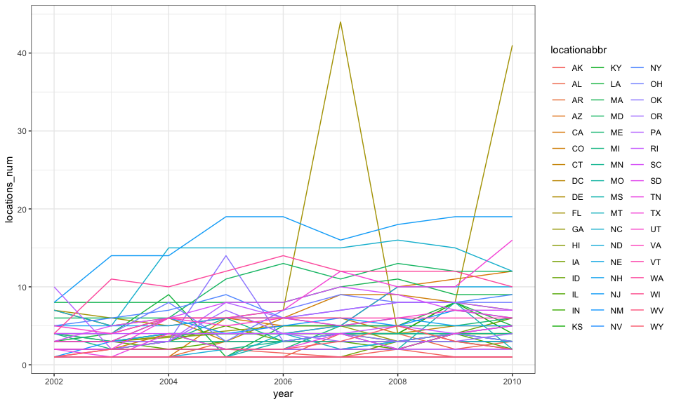

Homework\_3
================
Xinyi Lin
10/11/2018

``` r
library(tidyverse)
```

    ## ── Attaching packages ────────────────────────────────────────────────────────────── tidyverse 1.2.1 ──

    ## ✔ ggplot2 3.0.0     ✔ purrr   0.2.5
    ## ✔ tibble  1.4.2     ✔ dplyr   0.7.6
    ## ✔ tidyr   0.8.1     ✔ stringr 1.3.1
    ## ✔ readr   1.1.1     ✔ forcats 0.3.0

    ## ── Conflicts ───────────────────────────────────────────────────────────────── tidyverse_conflicts() ──
    ## ✖ dplyr::filter() masks stats::filter()
    ## ✖ dplyr::lag()    masks stats::lag()

``` r
theme_set(theme_bw() + theme(legend.position = "bottom"))
```

Problem 1
=========

Load and clean data
-------------------

``` r
brfss_df = 
  p8105.datasets::brfss_smart2010 %>% 
  janitor::clean_names() %>% 
  filter(topic == "Overall Health") %>% 
  mutate(response = factor(response, order=TRUE, levels = c("Excellent", "Very good", "Good", "Fair", "Poor")))
```

Answer questions
----------------

### Question 1

``` r
brfss_df %>% 
  filter(year == 2002) %>% 
  group_by(locationabbr) %>% 
  summarise(locations_num = length(unique(locationdesc))) %>% 
  filter(locations_num == 7)
```

    ## # A tibble: 3 x 2
    ##   locationabbr locations_num
    ##   <chr>                <int>
    ## 1 CT                       7
    ## 2 FL                       7
    ## 3 NC                       7

According to the table above, we can find that "CT", "FL", "NC" were observed at 7 locations.

### Question 2

``` r
brfss_df %>% 
  group_by(locationabbr, year) %>% 
  summarise(locations_num = length(unique(locationdesc))) %>% 
  ggplot(aes(x = year, y = locations_num, color = locationabbr)) +
  geom_line()
```



``` r
head(brfss_df)
```

    ## # A tibble: 6 x 23
    ##    year locationabbr locationdesc class topic question response sample_size
    ##   <int> <chr>        <chr>        <chr> <chr> <chr>    <ord>          <int>
    ## 1  2010 AL           AL - Jeffer… Heal… Over… How is … Excelle…          94
    ## 2  2010 AL           AL - Jeffer… Heal… Over… How is … Very go…         148
    ## 3  2010 AL           AL - Jeffer… Heal… Over… How is … Good             208
    ## 4  2010 AL           AL - Jeffer… Heal… Over… How is … Fair             107
    ## 5  2010 AL           AL - Jeffer… Heal… Over… How is … Poor              45
    ## 6  2010 AL           AL - Mobile… Heal… Over… How is … Excelle…          91
    ## # ... with 15 more variables: data_value <dbl>,
    ## #   confidence_limit_low <dbl>, confidence_limit_high <dbl>,
    ## #   display_order <int>, data_value_unit <chr>, data_value_type <chr>,
    ## #   data_value_footnote_symbol <chr>, data_value_footnote <chr>,
    ## #   data_source <chr>, class_id <chr>, topic_id <chr>, location_id <chr>,
    ## #   question_id <chr>, respid <chr>, geo_location <chr>

### Question 3

``` r
brfss_df %>% 
  filter(year == 2002 | year == 2006 | year == 2010, locationabbr == "NY", response == "Excellent") %>%
  group_by(year) %>% 
  summarise(excellent_mean = mean(data_value),
            excellent_sd = sd(data_value, na.rm = ))
```

    ## # A tibble: 3 x 3
    ##    year excellent_mean excellent_sd
    ##   <int>          <dbl>        <dbl>
    ## 1  2002           24.0         4.49
    ## 2  2006           22.5         4.00
    ## 3  2010           22.7         3.57

### Question 4

``` r
aver_prop_df =
  brfss_df %>% 
  group_by(year, locationabbr, response) %>% 
  summarise(average_proportion = mean(data_value))

# draw plot
ggplot(aver_prop_df, aes(x = year, y = average_proportion, color = locationabbr)) +
         geom_line() +
         facet_grid(.~ response)
```

    ## Warning: Removed 1 rows containing missing values (geom_path).


``` r
        #facet_wrap(~ response, nrow = 2)
```

Problem 2
=========

Load and describe data set
--------------------------

``` r
instacart_df =
  p8105.datasets::instacart %>% 
  janitor::clean_names()

head(instacart_df)
```

    ## # A tibble: 6 x 15
    ##   order_id product_id add_to_cart_ord… reordered user_id eval_set
    ##      <int>      <int>            <int>     <int>   <int> <chr>   
    ## 1        1      49302                1         1  112108 train   
    ## 2        1      11109                2         1  112108 train   
    ## 3        1      10246                3         0  112108 train   
    ## 4        1      49683                4         0  112108 train   
    ## 5        1      43633                5         1  112108 train   
    ## 6        1      13176                6         0  112108 train   
    ## # ... with 9 more variables: order_number <int>, order_dow <int>,
    ## #   order_hour_of_day <int>, days_since_prior_order <int>,
    ## #   product_name <chr>, aisle_id <int>, department_id <int>, aisle <chr>,
    ## #   department <chr>

The data set "instacart" records the data about orders information, it contains 1384617 observations and 15 variables. Among those variables, `order_id`, `order_number`, `aisle`, `department` are important.

Answer Questions
----------------

### Question 1

``` r
asile_num = length(unique(instacart_df$aisle))

aisle_item_df =
  instacart_df %>% 
  group_by(aisle, department) %>% 
  summarise(items_num = length(unique(product_name))) %>% 
  arrange(desc(items_num))

aisle_item_df
```

    ## # A tibble: 134 x 3
    ## # Groups:   aisle [134]
    ##    aisle               department items_num
    ##    <chr>               <chr>          <int>
    ##  1 candy chocolate     snacks           943
    ##  2 yogurt              dairy eggs       911
    ##  3 missing             missing          905
    ##  4 ice cream ice       frozen           901
    ##  5 chips pretzels      snacks           844
    ##  6 packaged cheese     dairy eggs       791
    ##  7 frozen meals        frozen           757
    ##  8 energy granola bars snacks           690
    ##  9 tea                 beverages        674
    ## 10 cookies cakes       snacks           654
    ## # ... with 124 more rows

There are 134 aisles and the "dairy eggs" aisle is the most items ordered from. Also, we can find that those which most items ordered from are sneaks. Besides, the number of aisle which most items ordered from and the number of aisle which least items ordered from are significant different.

### Question 2

``` r
library(ggrepel)

ggplot(aisle_item_df, aes(x = department, y = items_num)) + 
  geom_point() +
  geom_text_repel(aes(x = department, y = items_num, label = aisle))+
  theme_classic(base_size = 16)
```


``` r
  #facet_grid()
```

### Question 3

``` r
instacart_df %>% 
  filter(aisle == "baking ingredients" | aisle == "dog food care" | aisle == "packaged vegetables fruits") %>% 
  group_by(aisle, product_name) %>% 
  summarise(orders_num = length(unique(order_id))) %>% 
  arrange(aisle, desc(orders_num))
```

    ## # A tibble: 1,444 x 3
    ## # Groups:   aisle [3]
    ##    aisle              product_name                            orders_num
    ##    <chr>              <chr>                                        <int>
    ##  1 baking ingredients Light Brown Sugar                              499
    ##  2 baking ingredients Pure Baking Soda                               387
    ##  3 baking ingredients Cane Sugar                                     336
    ##  4 baking ingredients Premium Pure Cane Granulated Sugar             329
    ##  5 baking ingredients Organic Vanilla Extract                        327
    ##  6 baking ingredients Organic Unbleached All-Purpose Flour           291
    ##  7 baking ingredients All Purpose Flour                              277
    ##  8 baking ingredients 100% Pure Pumpkin                              247
    ##  9 baking ingredients Organic Cane Sugar                             244
    ## 10 baking ingredients Toll House Semi-Sweet Chocolate Morsels        206
    ## # ... with 1,434 more rows

Question 4
----------

``` r
instacart_df %>% 
  filter(product_name == "Pink Lady Apples" | product_name == "Coffee Ice Cream") %>% 
  group_by(product_name, order_dow) %>% 
  summarise(mean_hour_day = mean(order_hour_of_day)) %>% 
  #mutate(order_dow = weekdays(order_dow)) %>% 
  spread(key = order_dow, value = mean_hour_day)
```

    ## # A tibble: 2 x 8
    ## # Groups:   product_name [2]
    ##   product_name       `0`   `1`   `2`   `3`   `4`   `5`   `6`
    ##   <chr>            <dbl> <dbl> <dbl> <dbl> <dbl> <dbl> <dbl>
    ## 1 Coffee Ice Cream  13.8  14.3  15.4  15.3  15.2  12.3  13.8
    ## 2 Pink Lady Apples  13.4  11.4  11.7  14.2  11.6  12.8  11.9

According to the table, we can found that the difference of mean order hour of the day between two items or two days is not significant. And Wednesday is have more orders for two items.

Problem 3
=========

Load and describe data
----------------------

``` r
ny_noaa_df =
  p8105.datasets::ny_noaa %>% 
  janitor::clean_names()

ny_noaa_df
```

    ## # A tibble: 2,595,176 x 7
    ##    id          date        prcp  snow  snwd tmax  tmin 
    ##    <chr>       <date>     <int> <int> <int> <chr> <chr>
    ##  1 US1NYAB0001 2007-11-01    NA    NA    NA <NA>  <NA> 
    ##  2 US1NYAB0001 2007-11-02    NA    NA    NA <NA>  <NA> 
    ##  3 US1NYAB0001 2007-11-03    NA    NA    NA <NA>  <NA> 
    ##  4 US1NYAB0001 2007-11-04    NA    NA    NA <NA>  <NA> 
    ##  5 US1NYAB0001 2007-11-05    NA    NA    NA <NA>  <NA> 
    ##  6 US1NYAB0001 2007-11-06    NA    NA    NA <NA>  <NA> 
    ##  7 US1NYAB0001 2007-11-07    NA    NA    NA <NA>  <NA> 
    ##  8 US1NYAB0001 2007-11-08    NA    NA    NA <NA>  <NA> 
    ##  9 US1NYAB0001 2007-11-09    NA    NA    NA <NA>  <NA> 
    ## 10 US1NYAB0001 2007-11-10    NA    NA    NA <NA>  <NA> 
    ## # ... with 2,595,166 more rows

``` r
prcp_na_num =
  ny_noaa_df %>% 
  filter(is.na(prcp)) %>% 
  nrow()

snow_na_num =
  ny_noaa_df %>% 
  filter(is.na(snow)) %>% 
  nrow()

snwd_na_num =
  ny_noaa_df %>% 
  filter(is.na(snwd)) %>% 
  nrow()

tmax_na_num =
  ny_noaa_df %>% 
  filter(is.na(tmax)) %>% 
  nrow()

tmin_na_num =
  ny_noaa_df %>% 
  filter(is.na(tmin)) %>% 
  nrow() 
```

There are 2595176 observations and 7 variables in NY NOAA data, and key variables including `date`, `prcp`, `snow`. In `prcp` variables, the proportion of missing values is 5.62%. In `snow` variables, the proportion of missing values is 14.7%. In `snwd` variables, the proportion of missing values is 22.8%. In `tmax` variables, the proportion of missing values is 43.7%. In `tmin` variables, the proportion of missing values is 43.7%.
