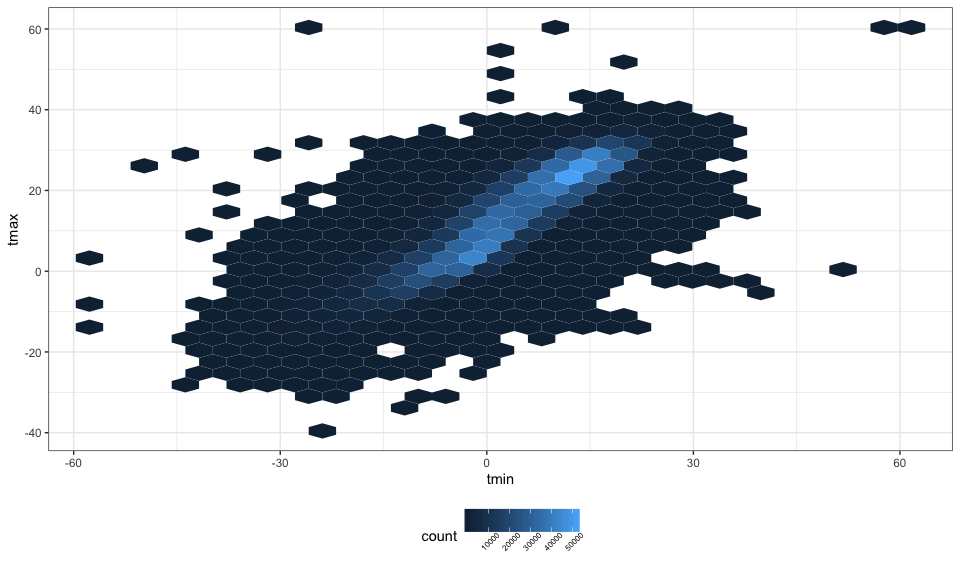

Homework\_3
================
Xinyi Lin
10/11/2018

``` r
library(tidyverse)
```

    ## ── Attaching packages ──────────────────────────────────────────────────────────────────────── tidyverse 1.2.1 ──

    ## ✔ ggplot2 3.0.0     ✔ purrr   0.2.5
    ## ✔ tibble  1.4.2     ✔ dplyr   0.7.6
    ## ✔ tidyr   0.8.1     ✔ stringr 1.3.1
    ## ✔ readr   1.1.1     ✔ forcats 0.3.0

    ## ── Conflicts ─────────────────────────────────────────────────────────────────────────── tidyverse_conflicts() ──
    ## ✖ dplyr::filter() masks stats::filter()
    ## ✖ dplyr::lag()    masks stats::lag()

``` r
knitr::opts_chunk$set(
  fig.width = 10,
  fig.asp = .6,
  out.width = "100%"
)

theme_set(theme_bw() + theme(legend.position = "bottom"))
```

Problem 1
=========

Load and clean data
-------------------

``` r
brfss_df = 
  p8105.datasets::brfss_smart2010 %>% 
  janitor::clean_names() %>% 
  filter(topic == "Overall Health") %>% 
  mutate(response = factor(response, order = TRUE, levels = c("Excellent", "Very good", "Good", "Fair", "Poor")))

head(brfss_df)
```

    ## # A tibble: 6 x 23
    ##    year locationabbr locationdesc class topic question response sample_size
    ##   <int> <chr>        <chr>        <chr> <chr> <chr>    <ord>          <int>
    ## 1  2010 AL           AL - Jeffer… Heal… Over… How is … Excelle…          94
    ## 2  2010 AL           AL - Jeffer… Heal… Over… How is … Very go…         148
    ## 3  2010 AL           AL - Jeffer… Heal… Over… How is … Good             208
    ## 4  2010 AL           AL - Jeffer… Heal… Over… How is … Fair             107
    ## 5  2010 AL           AL - Jeffer… Heal… Over… How is … Poor              45
    ## 6  2010 AL           AL - Mobile… Heal… Over… How is … Excelle…          91
    ## # ... with 15 more variables: data_value <dbl>,
    ## #   confidence_limit_low <dbl>, confidence_limit_high <dbl>,
    ## #   display_order <int>, data_value_unit <chr>, data_value_type <chr>,
    ## #   data_value_footnote_symbol <chr>, data_value_footnote <chr>,
    ## #   data_source <chr>, class_id <chr>, topic_id <chr>, location_id <chr>,
    ## #   question_id <chr>, respid <chr>, geo_location <chr>

Answer questions
----------------

### Question 1

``` r
brfss_df %>% 
  filter(year == 2002) %>% 
  group_by(locationabbr) %>% 
  summarise(locations_num = length(unique(locationdesc))) %>% 
  filter(locations_num == 7)
```

    ## # A tibble: 3 x 2
    ##   locationabbr locations_num
    ##   <chr>                <int>
    ## 1 CT                       7
    ## 2 FL                       7
    ## 3 NC                       7

According to the table above, we can find that "CT", "FL", "NC" were observed at 7 locations.

### Question 2

``` r
brfss_df %>% 
  group_by(locationabbr, year) %>% 
  summarise(locations_num = length(unique(locationdesc))) %>% 
  ggplot(aes(x = year, y = locations_num, color = locationabbr)) +
  geom_line() +
  theme(legend.position = "right")
```

 \#\#\# Question 3

``` r
brfss_df %>% 
  filter(year == 2002 | year == 2006 | year == 2010, locationabbr == "NY", response == "Excellent") %>%
  group_by(year) %>% 
  summarise(excellent_mean = mean(data_value),
            excellent_sd = sd(data_value, na.rm = ))
```

    ## # A tibble: 3 x 3
    ##    year excellent_mean excellent_sd
    ##   <int>          <dbl>        <dbl>
    ## 1  2002           24.0         4.49
    ## 2  2006           22.5         4.00
    ## 3  2010           22.7         3.57

### Question 4

``` r
aver_prop_df =
  brfss_df %>% 
  group_by(year, locationabbr, response) %>% 
  summarise(average_proportion = mean(data_value))

# draw plot
ggplot(aver_prop_df, aes(x = year, y = average_proportion, color = locationabbr)) +
  geom_point() + 
  facet_grid(.~ response) +
  ylab("aver_proportion(%)") +
  theme(legend.position = "left") + 
  theme(axis.text.x = element_text(angle = 45))
```

    ## Warning: Removed 21 rows containing missing values (geom_point).


Problem 2
=========

Load and describe data set
--------------------------

``` r
instacart_df =
  p8105.datasets::instacart %>% 
  janitor::clean_names()

head(instacart_df)
```

    ## # A tibble: 6 x 15
    ##   order_id product_id add_to_cart_ord… reordered user_id eval_set
    ##      <int>      <int>            <int>     <int>   <int> <chr>   
    ## 1        1      49302                1         1  112108 train   
    ## 2        1      11109                2         1  112108 train   
    ## 3        1      10246                3         0  112108 train   
    ## 4        1      49683                4         0  112108 train   
    ## 5        1      43633                5         1  112108 train   
    ## 6        1      13176                6         0  112108 train   
    ## # ... with 9 more variables: order_number <int>, order_dow <int>,
    ## #   order_hour_of_day <int>, days_since_prior_order <int>,
    ## #   product_name <chr>, aisle_id <int>, department_id <int>, aisle <chr>,
    ## #   department <chr>

The data set "instacart" records the data about orders information, it contains 1384617 observations and 15 variables and we loaded it as data.frame. Among those variables, `order_id`, `order_number`, `aisle`, `department` are important. For example, for the first observation, product"Bulgarian Yogurt" with id 49302 is the first product add in the number one order by user 112108. This order is the forth order of this user and it is placed at 10. The product comes from aisle "yogurt" and department "dairy eggs".

Answer Questions
----------------

### Question 1

``` r
asile_num = length(unique(instacart_df$aisle))

aisle_item_df =
  instacart_df %>% 
  group_by(aisle,department) %>% 
  summarise(items_num = n()) %>% 
  arrange(desc(items_num))

head(aisle_item_df)
```

    ## # A tibble: 6 x 3
    ## # Groups:   aisle [6]
    ##   aisle                         department items_num
    ##   <chr>                         <chr>          <int>
    ## 1 fresh vegetables              produce       150609
    ## 2 fresh fruits                  produce       150473
    ## 3 packaged vegetables fruits    produce        78493
    ## 4 yogurt                        dairy eggs     55240
    ## 5 packaged cheese               dairy eggs     41699
    ## 6 water seltzer sparkling water beverages      36617

There are 134 aisles and the "fresh vegetables" aisle is the most items ordered from. As we can find in the table, aisles which more items ordered from are ingredients we need everyday.

### Question 2

``` r
aisle_item_df %>% 
  as.data.frame() %>% 
  mutate(aisle = reorder(aisle, desc(items_num))) %>% 
  ggplot(aes(x = aisle, y = items_num)) + 
  geom_point() +
  theme(axis.text.x = element_text(angle = 45, hjust = 1, size = 5)) 
```


As we can see in the table, items ordered from first few asiles are far more than items ordered from other aisle, which shows this few asiles are far more popular than other asiles.

### Question 3

``` r
instacart_df %>% 
  filter(aisle == "baking ingredients" | aisle == "dog food care" | aisle == "packaged vegetables fruits") %>% 
  group_by(aisle, product_name) %>% 
  summarise(orders_num = length(unique(order_id))) %>% 
  mutate(rank = min_rank(desc(orders_num))) %>% 
  filter(rank == 1)
```

    ## # A tibble: 3 x 4
    ## # Groups:   aisle [3]
    ##   aisle                product_name                       orders_num  rank
    ##   <chr>                <chr>                                   <int> <int>
    ## 1 baking ingredients   Light Brown Sugar                         499     1
    ## 2 dog food care        Snack Sticks Chicken & Rice Recip…         30     1
    ## 3 packaged vegetables… Organic Baby Spinach                     9784     1

We can find that even though the shown product are all most popular items in each aisle, their orders number are totally different, which shows people need more units of packaged vegetables fruits or baking ingredients than dog food care.

Question 4
----------

``` r
instacart_df %>% 
  filter(product_name == "Pink Lady Apples" | product_name == "Coffee Ice Cream") %>% 
  group_by(product_name, order_dow) %>% 
  summarise(mean_hour_day = mean(order_hour_of_day)) %>% 
  mutate(order_dow = factor(order_dow, levels = 0:6,
                      labels = c("Sun", "Mon", "Tue", "Wed", "Thu", "Fri", "Sat"))) %>% 
  spread(key = order_dow, value = mean_hour_day)
```

    ## # A tibble: 2 x 8
    ## # Groups:   product_name [2]
    ##   product_name       Sun   Mon   Tue   Wed   Thu   Fri   Sat
    ##   <chr>            <dbl> <dbl> <dbl> <dbl> <dbl> <dbl> <dbl>
    ## 1 Coffee Ice Cream  13.8  14.3  15.4  15.3  15.2  12.3  13.8
    ## 2 Pink Lady Apples  13.4  11.4  11.7  14.2  11.6  12.8  11.9

According to the table, we can found that the difference of mean order hour of the day between two items or two days is not significant. And there are more orders for two items in Wednesday.

Problem 3
=========

Load and describe data
----------------------

``` r
ny_noaa_df =
  p8105.datasets::ny_noaa %>% 
  janitor::clean_names()

ny_noaa_df
```

    ## # A tibble: 2,595,176 x 7
    ##    id          date        prcp  snow  snwd tmax  tmin 
    ##    <chr>       <date>     <int> <int> <int> <chr> <chr>
    ##  1 US1NYAB0001 2007-11-01    NA    NA    NA <NA>  <NA> 
    ##  2 US1NYAB0001 2007-11-02    NA    NA    NA <NA>  <NA> 
    ##  3 US1NYAB0001 2007-11-03    NA    NA    NA <NA>  <NA> 
    ##  4 US1NYAB0001 2007-11-04    NA    NA    NA <NA>  <NA> 
    ##  5 US1NYAB0001 2007-11-05    NA    NA    NA <NA>  <NA> 
    ##  6 US1NYAB0001 2007-11-06    NA    NA    NA <NA>  <NA> 
    ##  7 US1NYAB0001 2007-11-07    NA    NA    NA <NA>  <NA> 
    ##  8 US1NYAB0001 2007-11-08    NA    NA    NA <NA>  <NA> 
    ##  9 US1NYAB0001 2007-11-09    NA    NA    NA <NA>  <NA> 
    ## 10 US1NYAB0001 2007-11-10    NA    NA    NA <NA>  <NA> 
    ## # ... with 2,595,166 more rows

``` r
prcp_na_num =
  ny_noaa_df %>% 
  filter(is.na(prcp)) %>% 
  nrow()

snow_na_num =
  ny_noaa_df %>% 
  filter(is.na(snow)) %>% 
  nrow()

snwd_na_num =
  ny_noaa_df %>% 
  filter(is.na(snwd)) %>% 
  nrow()

tmax_na_num =
  ny_noaa_df %>% 
  filter(is.na(tmax)) %>% 
  nrow()

tmin_na_num =
  ny_noaa_df %>% 
  filter(is.na(tmin)) %>% 
  nrow() 
```

There are 2595176 observations and 7 variables in NY NOAA data. We loaded this data as data.frame. Key variables including `date`, `prcp`, `snow`. In `prcp` variables, the proportion of missing values is 5.62%. In `snow` variables, the proportion of missing values is 14.7%. In `snwd` variables, the proportion of missing values is 22.8%. In `tmax` variables, the proportion of missing values is 43.7%. In `tmin` variables, the proportion of missing values is 43.7%. There are almost half of values are missing in `tmax` and `tmin` variables, and one fifth of values are missing in `snwd` variable. All of these missing values bring trouble to further data analysis.

Answer questions
----------------

### Question 1

First, we need to clean the data.

``` r
ny_noaa_clean = 
  ny_noaa_df %>% 
  separate(date, into = c("year", "month", "day"), sep = "-") %>% 
  mutate(year = as.numeric(year),
         month = as.numeric(month),
         day = as.numeric(day),
         prcp = as.numeric(prcp)/10,
         snow = as.numeric(snow),
         snwd = as.numeric(snwd),
         tmax = as.numeric(tmax)/10,
         tmin = as.numeric(tmin)/10)

head(ny_noaa_clean)
```

    ## # A tibble: 6 x 9
    ##   id           year month   day  prcp  snow  snwd  tmax  tmin
    ##   <chr>       <dbl> <dbl> <dbl> <dbl> <dbl> <dbl> <dbl> <dbl>
    ## 1 US1NYAB0001  2007    11     1    NA    NA    NA    NA    NA
    ## 2 US1NYAB0001  2007    11     2    NA    NA    NA    NA    NA
    ## 3 US1NYAB0001  2007    11     3    NA    NA    NA    NA    NA
    ## 4 US1NYAB0001  2007    11     4    NA    NA    NA    NA    NA
    ## 5 US1NYAB0001  2007    11     5    NA    NA    NA    NA    NA
    ## 6 US1NYAB0001  2007    11     6    NA    NA    NA    NA    NA

Then, we calculate the most commonly observed values for snowfall.

``` r
table(ny_noaa_clean$snow) %>% 
  data.frame() %>% 
  arrange(desc(Freq)) %>% 
  head()
```

    ##   Var1    Freq
    ## 1    0 2008508
    ## 2   25   31022
    ## 3   13   23095
    ## 4   51   18274
    ## 5   76   10173
    ## 6    8    9962

According to the table, we can find 0 is the most commonly observed values. As snow doesn't appear often, "no snowfall" apears most, so the most commonly observed values is 0.

### Question 2

``` r
ny_noaa_clean %>% 
  filter(!is.na(tmax), month == 1 | month == 7) %>% 
  mutate(month = month.name[month]) %>% 
  group_by(id, year, month) %>% 
  summarise(aver_tmax = mean(tmax)) %>% 
  ggplot(aes(x = year, y = aver_tmax)) +
  geom_boxplot(aes(group = year)) +
  facet_grid(.~ month)
```


According to the plot, we can find that both "January" table and "July" table have outliers. Tmax in "January"" has a larger range, while the mean of tmax of January is lower.

### Question 3

First table.

``` r
temp_plot =
  ny_noaa_clean %>% 
  filter(!is.na(tmin), !is.na(tmax)) %>% 
  ggplot(aes(x = tmin, y = tmax)) +
  geom_hex() + 
  theme(legend.text = element_text(angle = 45, size = 6))

temp_plot
```



Second table.

``` r
snow_plot =
  ny_noaa_clean %>% 
  filter(snow > 0 & snow < 100) %>% 
  ggplot(aes(x = year, y = snow)) +
  geom_boxplot(aes(group = year))

snow_plot
```


``` r
library(patchwork)

temp_plot + snow_plot
```


According to the first plot, we can find, most `tmax` and `tmin` values are around 0, which means tempretures around 0 appear most. According to the second plot, we can find from 1980 to 1995, the distribution of snowfall values greater than 0 and less than 100 are similar, however, outliers start to appear and 1.5 IQR of the lower quartile and upper quartile are lower after 1997. And the medians are the same across year.
