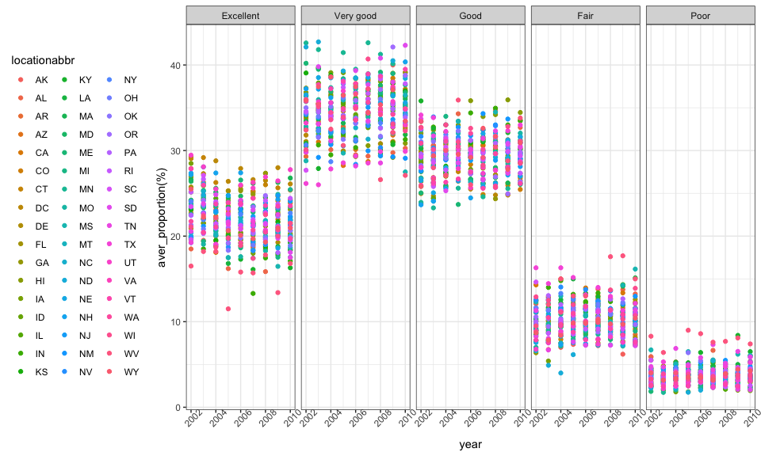

Homework\_3
================
Xinyi Lin
10/11/2018

``` r
library(tidyverse)
```

    ## ── Attaching packages ────────────────────────────────────────────────────────────── tidyverse 1.2.1 ──

    ## ✔ ggplot2 3.0.0     ✔ purrr   0.2.5
    ## ✔ tibble  1.4.2     ✔ dplyr   0.7.6
    ## ✔ tidyr   0.8.1     ✔ stringr 1.3.1
    ## ✔ readr   1.1.1     ✔ forcats 0.3.0

    ## ── Conflicts ───────────────────────────────────────────────────────────────── tidyverse_conflicts() ──
    ## ✖ dplyr::filter() masks stats::filter()
    ## ✖ dplyr::lag()    masks stats::lag()

``` r
theme_set(theme_bw() + theme(legend.position = "bottom"))
```

Problem 1
=========

Load and clean data
-------------------

``` r
brfss_df = 
  p8105.datasets::brfss_smart2010 %>% 
  janitor::clean_names() %>% 
  filter(topic == "Overall Health") %>% 
  mutate(response = factor(response, order=TRUE, levels = c("Excellent", "Very good", "Good", "Fair", "Poor")))
```

Answer questions
----------------

### Question 1

``` r
brfss_df %>% 
  filter(year == 2002) %>% 
  group_by(locationabbr) %>% 
  summarise(locations_num = length(unique(locationdesc))) %>% 
  filter(locations_num == 7)
```

    ## # A tibble: 3 x 2
    ##   locationabbr locations_num
    ##   <chr>                <int>
    ## 1 CT                       7
    ## 2 FL                       7
    ## 3 NC                       7

According to the table above, we can find that "CT", "FL", "NC" were observed at 7 locations.

### Question 2

``` r
brfss_df %>% 
  group_by(locationabbr, year) %>% 
  summarise(locations_num = length(unique(locationdesc))) %>% 
  ggplot(aes(x = year, y = locations_num, color = locationabbr)) +
  geom_line()
```

 \#\#\# Question 3

``` r
brfss_df %>% 
  filter(year == 2002 | year == 2006 | year == 2010, locationabbr == "NY", response == "Excellent") %>%
  group_by(year) %>% 
  summarise(excellent_mean = mean(data_value),
            excellent_sd = sd(data_value, na.rm = ))
```

    ## # A tibble: 3 x 3
    ##    year excellent_mean excellent_sd
    ##   <int>          <dbl>        <dbl>
    ## 1  2002           24.0         4.49
    ## 2  2006           22.5         4.00
    ## 3  2010           22.7         3.57

### Question 4

``` r
aver_prop_df =
  brfss_df %>% 
  group_by(year, locationabbr, response) %>% 
  summarise(average_proportion = mean(data_value))

# draw plot
ggplot(aver_prop_df, aes(x = year, y = average_proportion, color = locationabbr)) +
         geom_line() +
         facet_grid(. ~ response)
```

    ## Warning: Removed 1 rows containing missing values (geom_path).


